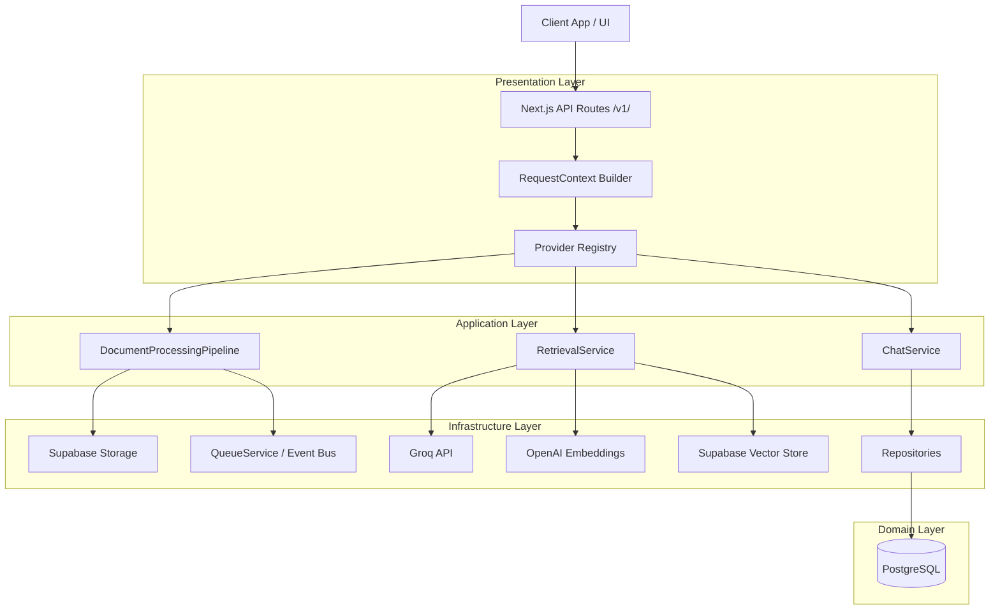

# Overall Architecture

PAL is an enterprise-grade, multi-tenant Retrieval-Augmented Generation (RAG) platform. It is engineered with a **Production-First Serverless Architecture** targeted at Vercel. 

## Clean Architecture

The codebase strictly follows Clean Architecture principles, ensuring that business logic is completely isolated from infrastructure concerns (like databases, LLM APIs, and file storage).

### Layers
1. **Domain Layer**: Contains fundamental entities (`User`, `KnowledgeBase`, `Document`, `Chunk`, `Message`, `Conversation`) and abstract interfaces for providers.
2. **Application Layer**: Contains the business logic (`RetrievalService`, `DocumentProcessingPipeline`). It orchestrates domain entities and relies solely on interfaces.
3. **Infrastructure Layer**: Contains concrete implementations of providers (`GroqLLMProvider`, `SupabaseVectorStore`, `LocalStorageProvider`, `ConsoleLogger`).
4. **Presentation/API Layer**: The Next.js Route Handlers. Their only job is to construct the `RequestContext`, inject dependencies, and return HTTP responses.

## SOLID Principles
- **Single Responsibility**: Every class and layer has one reason to change.
- **Open/Closed**: The application is open to new providers (e.g., adding an `AnthropicLLMProvider`) without modifying the `RetrievalService`.
- **Liskov Substitution**: Any `EmbeddingProvider` can be substituted without the pipeline failing.
- **Interface Segregation**: Providers implement small, focused interfaces (`Logger`, `StorageProvider`).
- **Dependency Inversion**: Application logic depends on abstractions (`LLMProvider`), not concrete classes (`GroqLLMProvider`).

## Mermaid: System Architecture

