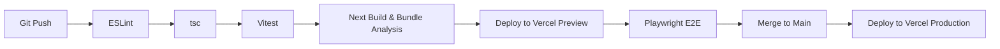

# Deployment Pipeline

PAL relies on a highly rigorous, automated CI/CD pipeline built on GitHub Actions. **No code can be deployed directly to Production without passing automated checks.**

## Deployment Environments
1. **Development**: Local machine, emulating Vercel via `next dev`.
2. **Preview**: A Vercel preview deployment bound to a Supabase Staging project. Data is isolated from Production.
3. **Production**: The source of truth on Vercel bound to the Production Supabase project.

## GitHub Actions Workflow

## Vercel Constraints Checklist
Before deployment, the bundle is analyzed to ensure:
- Edge runtime compatibility for middleware.
- Bundle sizes do not exceed 50MB (Serverless limit).
- No background node processes or daemons are instantiated in initialization files.
