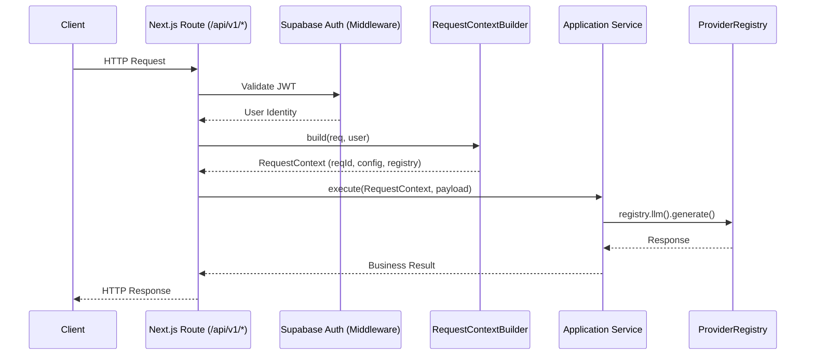
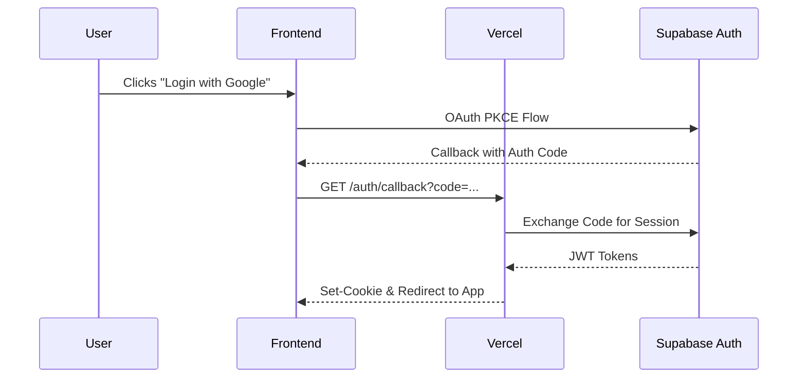

# Request Flow

## Standard API Request Flow

Every incoming request passes through a strictly defined lifecycle to guarantee security, statelessness, and traceability.

## Authentication Flow

Authentication utilizes Supabase SSR with JWTs stored in secure cookies.

