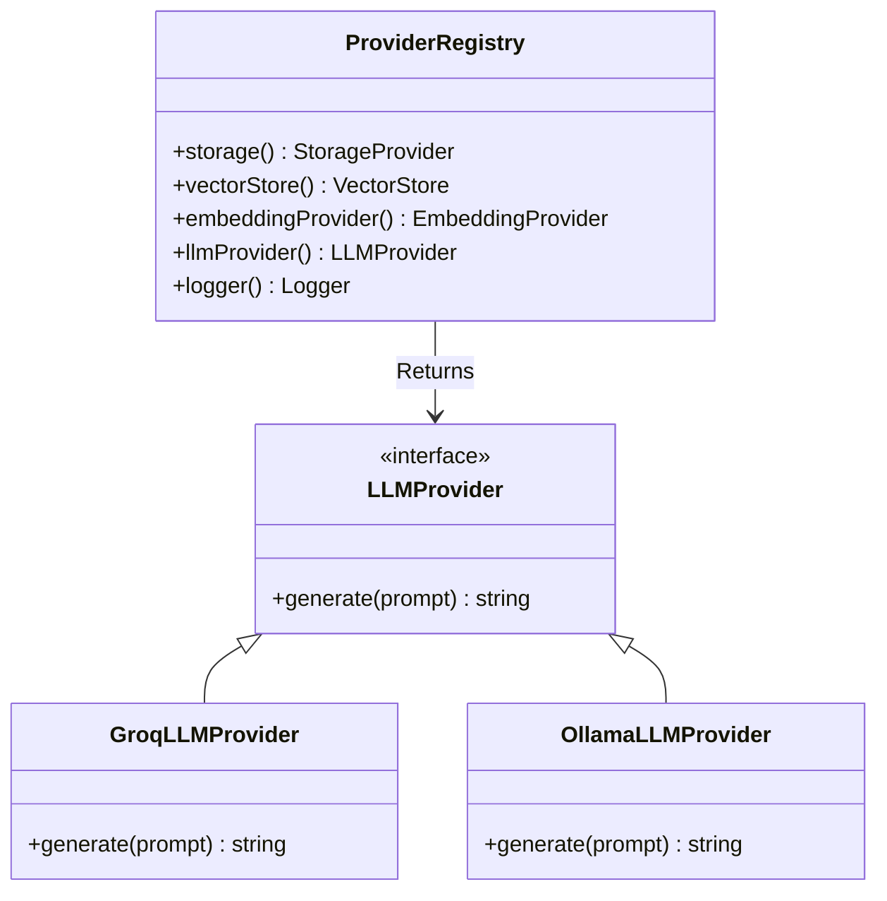

# System Design

This document details the core abstractions that power PAL's execution model.

## Request Context

Because Vercel Serverless environments scale horizontally and tear down rapidly, relying on stateful singletons or traditional IoC containers can lead to memory leaks or data pollution across requests.

Instead, PAL uses a **Request Context** architecture. At the edge of every `/api/v1/*` route, a `RequestContextBuilder` creates an immutable context object for that specific request.

The `RequestContext` contains:
- `requestId`: A UUID for end-to-end tracing.
- `user`: The authenticated user (or null).
- `flags`: Evaluated feature flags for this request.
- `config`: Environment configuration.
- `providers`: A scoped `ProviderRegistry`.
- `logger`: A configured logger pre-injected with the `requestId`.

## Provider Registry

Application code never instantiates providers directly. Providers are fetched from the `ProviderRegistry`, which resolves the correct concrete class based on configuration.

## Repository Pattern & Domain Model

All persistence is encapsulated within Repositories. Application logic never calls Supabase directly.

### Core Domain Entities
- **KnowledgeBase**: The isolated container for documents and configuration.
- **Document**: A raw uploaded file.
- **Chunk**: A vectorized segment of a Document.
- **Conversation**: A chat thread bound to a Knowledge Base.
- **Message**: A single interaction in a Conversation.
